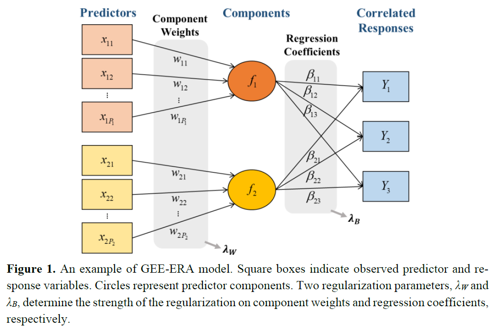
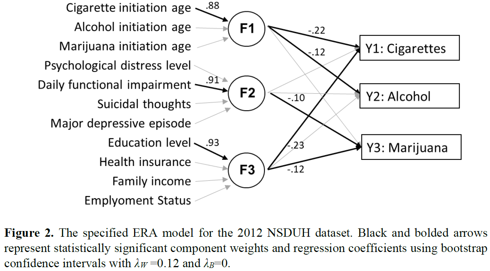

GEE of ERA
====================================================

An Application of Regularized Extended Redundancy Analysis via Generalized Estimating Equations to the Study of Co-occurring Substance Use among US Adults

Authors
-------

- **Sunmee Kim** - <sunmee.kim@mail.mcgill.ca>

About GEE of ERA
----------
According to the National Survey on Drug Use and Health (NSDUH), the co-use of recreational substances is prevalent in the US population and en-genders serious public health consequences. Additionally, substance use is an example of a complex social phenomenon that involves a large number of potentially correlated predictors. Considering the interdependence in the use of cigarettes, alcohol, and marijuana among US adults, the purpose of this study is to investigate simultaneously the effects of multiple sets of predictors (regarding substance initiation age, mental health status, and socioeconomic status) on the use of these three substances. For this, we applied a recently proposed extension of extended redundancy analysis (ERA), named GEE-ERA, to the 2012 NSDUH data. ERA performs data reduction and linear regression simultaneously, producing a simpler description of directional relationships between multiple sets of predictors and response variables. The new extension, GEE-ERA, combines ERA with generalized estimating equations (GEE) to enable fitting a regression on a set of correlated responses with unknown correlation structure. This method also adopts ridge-type regularization to address any potential overfitting, while the strength of the regularization is determined automatically through cross-val-idation. The major findings obtained by applying GEE-ERA to the 2012 NSDUH data are: (1) Earlier substance use was associated with greater current use of both cigarettes and alcohol; (2) worse mental health status influenced greater mariju-ana use, only; and (3) a lower level of SES was associated with higher levels of both cigarette and marijuana use.

